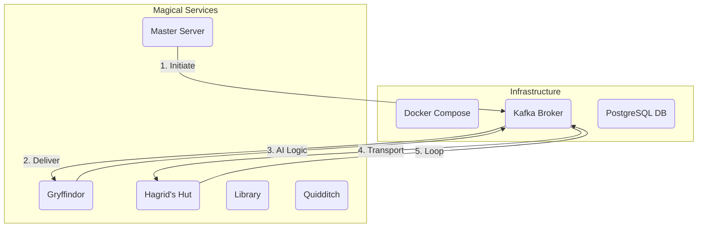

# 🏰 Distributed Harry Potter Universe

### A Fault-Tolerant, Event-Driven Simulation

> "No frontend (for now). Only spells, asynchronous owl messages, and AI-driven decisions."

## 🧙‍♂️ The Engineering Challenge

Most microservices use simple HTTP requests. I wanted to build a **truly asynchronous, event-driven system** where the "Master Server" doesn't just call other services—it initiates an event that lives and evolves within a **Kafka infrastructure**.

## 🏗️ Architecture: The Wizarding World on Rails

Each location in the Wizarding World is a standalone Node.js microservice. Characters are serialized into JSON and "transported" through Kafka topics, simulating real-time state synchronization across a distributed environment.

- **The Brain:** Generative AI logic resides within each service to determine the next plot point and destination.
- **The Transport:** **Apache Kafka** manages the character message pipeline, ensuring "at-least-once" delivery.
- **The Memory:** **PostgreSQL** with **Prisma** maintains the persistent state of every character's location and history.




## 💡 Engineering Wins

- **Sub-50ms Latency:** Achieved high-speed real-time synchronization across 8+ containerized services using Kafka.
- **95% Automation Coverage:** Implemented AI-driven decision logic to automate character movement and scene generation.
- **Full Containerization:** The entire universe (8 services + Kafka + Zookeeper + DB) launches with a single `docker-compose` command.
- **Fault Tolerance:** If a service (e.g., "Hagrid's Hut") goes down, Kafka holds the character messages until the service recovers.

## 🧰 Tech Stack

- **Messaging:** Apache Kafka (Event-Streaming) 
- **Infrastructure:** Docker, Docker Compose 
- **Runtime:** Node.js 
- **Data:** PostgreSQL, Prisma ORM 
- **Intelligence:** Google Gemini AI (Decision Logic) 

---

## 🐳 Quick Start (One Command Universe)

### 1. Launch the Universe

```bash
docker-compose up --build

```

### 2. Cast the First Spell

Open a new terminal and "initiate" the world:

```bash
curl http://localhost:3008/initate

```

### 📜 Live Logs (The "Owl Post")

Watch your terminal for real-time Kafka event streams:

```text
🕊️ From: Quidditch Pitch
👥 Character: Harry, Draco
📖 Scene: Seeker dual results in a tie; moving to Great Library for research.
════════════════════════════════════════════════════════════
🕊️ Sent To: library-messages

```

---

## 📂 Microservice Directory

| Service | Port | Responsibility |
| --- | --- | --- |
| **Master** | 3008 | Controller & API Gateway |
| **Gryffindor** | 3002 | Common room event logic |
| **Quidditch** | 3007 | High-concurrency sports logic |
| **Platform 9 ¾** | 3006 | Central transportation hub |

---
